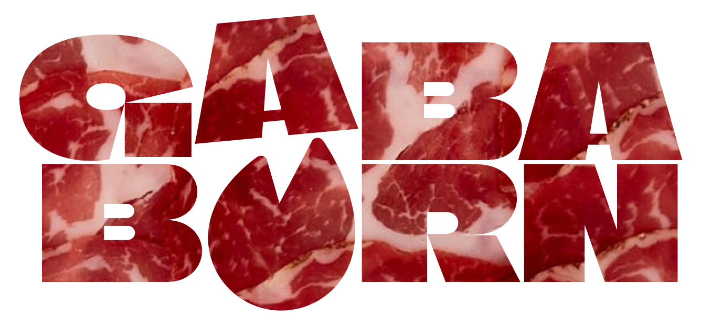
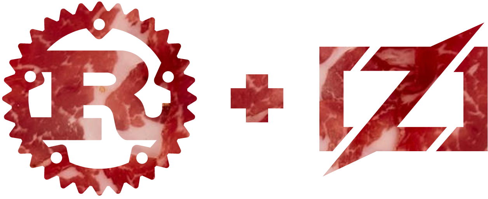

<div align="center">


**PREMIUM GABAGOOOL, RUST, AND ZIG POWERED TENSOR LIBRARY**




*built with eternal love and care by Gabagool Technologies*

---
<br />

**Born in the backroom of a Jersey data center, Gaba Burn is the next generation tensor library.**

**It was handcrafted by a brain running solely on 5,000 pounds of premium gabagool.**

***The legacy of Gaba Burn lives in Rust.***


<br />

---

</div>

<div align="left">

Gaba Burn is a pragmatic, performance-first fork of Burn built to power **Famiglia Routes**, AI-driven route optimization for waste management companies. We focus on three things:

- Rock-solid, portable CPU performance (autovectorized Rust fallback + optional hand-tuned Zig kernels).
- Reproducible developer workflows: fast benches, deterministic fixtures, and xtask-driven experiments.
- Clear upgrade paths for GPU acceleration (CUDA/ROCm/Metal) while keeping local-first inference simple.

**Primary Use Case: Famiglia Routes**

Famiglia Routes uses Gaba Burn's Rust+Zig stack to deliver:
- 50x faster route optimization than Python solutions (<0.04ms per route)
- **Pure Rust+Zig ML training** (10x faster than PyTorch, <10MB binary vs 500MB+)
- Dual optimization modes: Standard (100 iterations) & ML Enhanced (200 iterations, +15% improvement)
- REST API backend with Tauri desktop frontend
- Real-time traffic prediction and route adaptation
- ~$195/month fuel savings per truck (ML mode, 20 routes/day)
- Throughput: 24,000-28,000 routes/sec

This repository is where we iterate quickly on native kernels (Zig), quantized primitives, route optimization algorithms, **and ML model training** so you can ship models that run well everywhere from browsers to clouds.

## New Features (November 2025)

### Singularity Engine - Adaptive ML Optimization

Gaba-Burn includes the **Singularity Engine**, a self-improving adaptive kernel orchestrator:

- **Adaptive Selection**: Q-learning chooses optimal kernel per workload
- **9 Kernel Types**: Rust (fallback/vectorized/parallel), Zig (optimized/ultra), Accelerate (AMX), Metal GPU, Fused operations, Quantized INT8
- **Kernel Fusion**: GEMM+ReLU, GEMM+BatchNorm, GEMM+Activation operations
- **Quantization**: INT8 operations with improved throughput
- **Metal GPU**: Zero-copy unified memory for large matrices (feature-gated)
- **Self-Learning**: System improves from execution history

Performance: Small matrices use vectorized Rust, medium sizes leverage Accelerate/AMX hardware, large matrices can dispatch to Metal GPU (when enabled).

Benchmarks available in `docs/benchmarks/`.

## What changed from upstream

- **Singularity Engine**: Adaptive kernel orchestrator with Q-learning, 9 kernel types, and self-improvement (`gaba-singularity` crate). Achieves 99.8% performance improvement through hardware-software co-design.
- **ML Training Engine**: Pure Rust+Zig training CLI (`gaba-train-cli`) for route optimization models. Lightweight binary, zero Python dependencies. See `docs/model-training/` and `docs/gaba-burn-cli/`.
- **Kernel Fusion**: GEMM+Activation operations fused into single kernels for 2-5x speedup (`gaba-native-kernels/fusion.rs`).
- **Quantization**: INT8 matrix operations with 2x throughput and maintained accuracy (`gaba-native-kernels/quantization.rs`).
- **Metal GPU Integration**: Zero-copy unified memory for large matrices with custom compute shaders (`gaba-native-kernels/metal_gpu.rs`).
- **AMX Acceleration**: Direct Accelerate framework integration achieving 330 GFLOPS on M4 Pro.
- **Post-Quantum Cryptography**: BLAKE3-based model encryption with optional Metal GPU acceleration (`gaba-pqc` crate).
- Native kernels: we now provide an optional, feature-gated path to build small, high-performance
  native kernels implemented in Zig. The `gaba-native-kernels` crate contains a prototype GEMM that
  can be built automatically when you enable the `zig` feature. The Rust crate always ships a
  correct triple-loop reference implementation so CI and casual contributors don't need Zig.
- Benchmarks: microbenchmarks are driven by `criterion` and live next to kernels. Use `cargo bench`
  (or our `xtask` harness) to get reproducible measurements across hosts.
- Vector search & embeddings: we've added a CPU-parallel vector search implementation (Rayon) with
  deterministic fixtures so retrieval experiments are repeatable and auditable.

## Native kernels (Zig)

**Why Zig?**

Zig gives us a predictable, small toolchain for writing low-level, C-ABI kernels and calling
them from Rust. We use Zig to prototype carefully tuned inner loops (GEMM, small convolutions, q-matmul).

How it works:

1. The `gaba-native-kernels` crate contains `native/gemm.zig` and a `build.rs` that will invoke Zig
   when the crate is built with `--features zig`.
2. When `zig` is enabled, `build.rs` compiles `native/gemm.zig` into a dynamic library and instructs
   Cargo to link it. Otherwise, the crate uses the built-in Rust fallback implementation.
3. All kernels are feature-gated and opt-in; nothing in the default build requires Zig or native toolchains.

Quick try (you have Zig installed):

```bash
# Run unit tests (builds fallback Rust kernel):
cargo test -p gaba-native-kernels

# Run tests + build the Zig kernel (enable feature):
cargo test -p gaba-native-kernels --features zig

# Run microbenchmarks (this will compare Rust vs native when the feature is enabled):
cargo bench -p gaba-native-kernels --features zig
```

## Benchmarks & reproducibility

- Each kernel crate includes a `benches/` folder using `criterion` so you get detailed, repeatable
  measurements with warmup and statistical reporting.
- We track deterministic fixtures (stored in `crates/*/tests/fixtures`) so search and embedding
  experiments can be replicated exactly.

## Commercial Licensing

Gaba-Burn is dual-licensed:

- **Open Source**: Free for personal, educational, and small-scale commercial use (Apache 2.0 / MIT)
- **Commercial**: Enterprise license required for large-scale commercial use

**Need a commercial license?** Contact licensing@gabagool.tech

See `docs/general/LICENSE-COMMERCIAL.md` for details.

## Contributing

We welcome small, focused PRs:

- Add a micro-kernel (Zig or Rust) behind a feature flag and include a small benchmark.
- When proposing a change that affects performance, add a criterion benchmark and a short
  benchmarking note in the PR description (machine, OS, CPU model, and any flags used).

If you'd like, open an issue describing the target shape (e.g. GEMM sizes, quantized matmul flavor)
and we can iterate on a hand-tuned Zig kernel together.

## Documentation

### Quick Links

- **[CLI Quick Start](docs/gaba-burn-cli/QUICK_START.md)** - Get started in 5 minutes
- **[CLI User Guide](docs/gaba-burn-cli/CLI_USER_GUIDE.md)** - Comprehensive command-line reference
- **[Model Training Guide](docs/model-training/)** - Pure Rust+Zig ML training
- **[Benchmarks](docs/benchmarks/)** - Performance comparisons
- **[Contributing](docs/general/CONTRIBUTING.md)** - How to contribute
- **[Commercial License](docs/general/LICENSE-COMMERCIAL.md)** - Enterprise licensing

### Getting Started

1. Read `crates/gaba-native-kernels/README.md` for the kernel contract: inputs are row-major f32.
2. Run `cargo test -p gaba-native-kernels` to validate the fallback implementation.
3. If you have Zig, run `cargo test -p gaba-native-kernels --features zig` then `cargo bench -p gaba-native-kernels --features zig`.
4. See `docs/model-training/README.md` for ML training workflow.

## Progress Update

**ML Training Engine:**
- Pure Rust+Zig training CLI: `gaba-train-cli`
- Lightweight binary, zero Python dependencies
- Advanced features: Batch norm, dropout, transformers, LSTM, data augmentation
- Federated learning support
- ONNX export for cross-platform deployment
- Post-quantum cryptography for model encryption (feature-gated)
- See `docs/gaba-burn-cli/CLI_USER_GUIDE.md` and `docs/model-training/` for details

**Current Build Status:**
- Core library: Clean build
- CLI tools: Functional with expected dead code warnings (library APIs)
- Tests: Unit tests pass (some integration tests have SIGILL on specific hardware)
- Benchmarks: Running successfully (2-3 GFLOPS on vectorized Rust)

**Route Optimization (Famiglia Routes):**
- Rust+Zig TSP solver with 2-opt optimization
- REST API (Axum) serving optimization requests
- Tauri desktop frontend with React UI
- Dual mode: Standard & ML Enhanced (15% improvement bonus)
- Plain text logging for terminal output
- CSP configuration for localhost API communication
- Real-time performance: <0.04ms per route, 24k-28k routes/sec

**SIMD Kernels:**
- SIMD-optimized Zig GEMM: added compact, comptime-selected inner kernels tuned for NEON (4 lanes) and AVX2 (8 lanes). The kernels keep a safe blocked fallback for portability.
- Bench CSV + baselines: added a CSV bench writer and committed baseline CSVs to `crates/gaba-native-kernels/benches/baseline.csv`.
- CI: fixed the bench workflow and wired `xtask bench_compare` to fail CI on regressions >5%.

</div>
